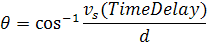
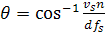

# Introduction

This document is intended to answer the questions from the *project proposal* using theory from multiple sources. It quotes the sources directly instead of writing it in our own words.

**!!WARNING: In the current state it only lists the parts of the sources which can be used to answer the questions there should therefore not be any copy/pasting from this document to the final document!!**

# Questions

1. "How accurate is TDAoA (in degrees) using this technique?"
2. "What is the relationship of the distance between the microphones and the accuracy?"
3. "How sensitive is this technique to noise?"
4. "What happens to the accuracy if the distance or angle of the sound source is increased?"
5. "How much processing time (in µS) does TDAoA using cross-correlation use per run for a given number of samples?"
6. "How does the sample resolution and sample rate affect the accuracy?"
7. "What is the minimum number of samples that have to be processed for using the cross-correlation algorithm?"


# Theory for each source

## 1) "How accurate is TDAoA (in degrees) using this technique?"

[See Robotic Microphone Sensing - Variable Angle Case](https://ese.wustl.edu/ContentFiles/Research/UndergraduateResearch/CompletedProjects/WebPages/fl09/rms3/Current%20work.htm)

-- See Implementing a Microphone Array on a Mobile Robotic Device - 2. Background


## 2) "What is the relationship of the distance between the microphones and the accuracy?"

[See Robotic Microphone Sensing - Variable Angle Case](https://ese.wustl.edu/ContentFiles/Research/UndergraduateResearch/CompletedProjects/WebPages/fl09/rms3/Current%20work.htm)

-- See Implementing a Microphone Array on a Mobile Robotic Device - 2. Background


## 3) "How sensitive is this technique to noise?"

-- Can be calculated using the theory from S02 on convolution

-- See Implementing a Microphone Array on a Mobile Robotic Device - 2. Background


## 4) "What happens to the accuracy if the distance or angle of the sound source is increased?"

[See Robotic Microphone Sensing - Variable Angle Case](https://ese.wustl.edu/ContentFiles/Research/UndergraduateResearch/CompletedProjects/WebPages/fl09/rms3/Current%20work.htm)


## 5) "How much processing time (in µS) does TDAoA using cross-correlation use per run for a given number of samples?"

-- Can be calculated using the formula for cross correlation


## 6) "How does the sample resolution and sample rate affect the accuracy?"

[See Robotic Microphone Sensing - Variable Angle Case](https://ese.wustl.edu/ContentFiles/Research/UndergraduateResearch/CompletedProjects/WebPages/fl09/rms3/Current%20work.htm)


## 7) "What is the minimum number of samples that have to be processed for using the cross-correlation algorithm?"

-- Can be estimated when the formula for a signal and the cross correlation algorithm is known


## Subquestions

### How to translate the time difference to an angle?

```
This simplification is valid under the circumstances given by the inequality,

R > 2d^2 / lambda

Where R is the radial distance to the sound source, d is the distance between the microphones, and lambda is the wavelength of the incoming wave. Approximating the wave as planar is necessary to simplify the geometry involved in calculating of the angle of arrival.

Assuming this approximation holds, the angle of an incoming sound wave can be calculated as a function of the delay between the arrival of the sound wave between at microphones.

The expression for angle of arrival is provided by.
```



```
Where phi is a function of the speed of sound, Vs, the time delay, and d the length between the two microphones.

It is important to note that the final result should be in discrete time because the signal is processed in the digital domain. Thus the delay is ultimately given in terms of the difference in number of samples between the two microphones.  Converting from continuous time to discrete time,

---

Where n is the number of samples, and  is the sampling frequency of the data acquisition system. Substituting, the final expression is found,
```



[Source: Robotic microphone sensing - Angle of Arrival](https://ese.wustl.edu/ContentFiles/Research/UndergraduateResearch/CompletedProjects/WebPages/fl09/rms3/angle%20of%20arrival.htm)


### How to implement a cross-correlation algorithm


```
Where X1 and X2 are the signals from the two microphones and τ is represents the delay of the system. Qualitatively, this function represents the process of evaluating all possible delays for the two signals, and for each delay, multiplying X1 by X2. This function should then produce a maximum at the delay value which most closely corresponds to the actual delay.
```

[Source: Robotic microphone sensing - Time Delay Estimation](https://ese.wustl.edu/ContentFiles/Research/UndergraduateResearch/CompletedProjects/WebPages/fl09/rms3/angle%20of%20arrival.htm)

# List of sources

