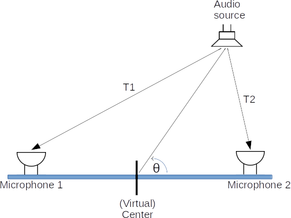
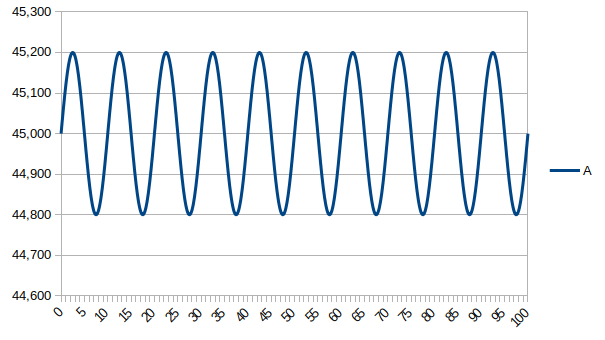

# Project proposal

**Linear systems, signals and control (5LIU0) - Design Project**

**Topic: Time-delay angle-of-arrival estimation**

*Authors:*  
Benno Driessen (1399268 - b.p.a.driessen@student.tue.nl)  
Robert Paauw (1218883 - r.paauw@student.tue.nl)  

*Date: 30-11-2018*  
*Version 1.0*

# Introduction
Time-delay angle-of-arrival estimation (TDAoA) is the technique of using two or multiple receivers to identify from which direction a particular signal is coming. For this project we will look at TDAoA for audio. The basic idea is that sound travels with a known speed (about 343m/s) and as a result it is possible to calculate distance from the time it takes to reach a certain location. If two microphones are placed at a known distance from each other then the angle can be calculated using the time difference between the audio arriving at microphone 1 and 2. This is shown in the figure below. It is suggested that this time difference can be extracted using cross-correlation on the signals from the microphones. Since signal processing is one of the main subjects of this course it will be the focus of this project. The project organization from the study guide will be used as guideline for this project.

## Example applications

Time-delay angle-of-arrival estimation on sound could potentially be used in a wide variety of domains. A few examples of applications where this technique might be interesting for:

- Conference calls - identify who speaks at a certain moment
- In home handfree video calls - aim the camera on the speaker and use beam-forming to improve sound quality
- Military - identify where the enemy is located based on sound
- Industrial - asset tracking in a factory or wharehouse using a "chirp"
- Marketing/analytics - Tracking costumers across a store to investigate patterns and improve the store's layout (there might be privacy concerns with this)

# Definitions

In the following paragraphs a few terms will be uses that need further clarification and/or definition.

## Accuracy

The *accuracy* of the estimation is defined as how large the error is between the estimated value and the real value. For TDAoA it is defined here as error in angle (in degrees) between these values.
$$
\begin{align*}
Error = θ_{measured} - θ_{actual}
\end{align*}
$$
The accuracy consists of two parts. The first part is the *static error* which looks at the average error. The second part is the *deviation* which is the difference between the highest and lowest value of N measurements. An example is given below. If the actual value is 44,7 degrees then the *static error* is (45,0 - 44,7 = ) 0,3 degrees. The deviation is then (45,2 - 44,8 =) 0,4 degrees.

## Noise

For this project two types of noise are considered. One is *acoustic noise* and the other is *electronic noise*. Acoustic noise is audible noise produced from one or more audio sources that are not the main audio source.  For example lets say TDAoA is used to track which person is speaking in a conference call on a hot day. In the background there is an AC unit blowing to cool down the room. The sound of the AC unit eventually reaches both microphones and could therefore potentially interfere with the algorithm.

The other type of noise is electronic noise (mostly white noise) which is produced by the microphone and amplifier. This is *random noise* which is different for both microphone channels. Electronic noise is hard to modify in the real world and so will only be considered in the theory and simulations.

# Project goals

The main goal of this project is to get some experience with research on and implementation of a digital signal processing algorithm. To do this an TDAoA algorithm will be implemented. This goal can be achieved by answering the research questions below.

## Primary question

The primary research question that will be answered at the end of the project is:
"*What are the characteristics of TDAoA estimation based on the cross-correlation algorithm?*"

## Secondary questions involve:

These secondary questions help answering the primary question. These questions will be answered with theory, simulation and real-world testing where possible.

1. "How accurate is TDAoA (in degrees) using this technique?"
1. "What is the relationship of the distance between the microphones and the accuracy?"
1. "How sensitive is this technique to noise?"
1. "What happens to the accuracy if the distance or angle of the sound source is increased?"
1. "How much processing time (in µS) does TDAoA using cross-correlation use per run for a given number of samples?"
1. "How does the sample resolution and sample rate affect the accuracy?"
1. "What is the minimum number of samples that have to be processed for using the cross-correlation algorithm?"

## Questions that are *outside* the scope of this project:

The following questions are interesting but will not contribute much to this project and are mentioned for completeness.

- "Is it possible to estimate the distance to the object with this method and a third microphone?"
- "Is it possible to estimate both *polar angle* and *azimuth angle* using this method a third microphone?"
- "Is it possible to distinguish between two or more audio sources using this method?"

# Measurement and verification

To measure the accuracy of the system an audio source will be placed at a known location relative to the microphones. In the simulations the position is known and as a result the time delay between the microphones will be calculated using basic trigonometry. The audio source will be represented as a single point. With this model it is also possible to model the signal's amplitude.
For the *real world* testing a large protractor (printed on A3 paper) will be used in combination with a straight piece of wood or a laser pointer. A loudspeaker will be used as audio source and it will be placed at a specified angles. These measurements will be repeated at different angles, distances of the audio source and distance between microphones to obtain characteristics for those parameters. Three different audio signals that are representative for the use cases defined in the introduction will be used:

- A series of short beeps
- A chirp
- A prerecorded speech sample

The influence on noise can be obtained from simulations by adding a white noise signal to the original audio signal. This way the amplitude of the noise can be defined with great accuracy. In the real world testing an audio source with white noise can be added to the room for comparison with the theoretical and simulated effect.
For measurement of the algorithm's computing time there are two approaches (of which one will be selected later on). One way is to use a hardware timer from the microcontroller that is started on the beginning of the computation and stopped at the end. An other method would be to set a pin *high* when entering the computation function and setting it *low* again when leaving this. Then an external timer or oscilloscope can be used to measure the elapsed time.
The question about what the effect of sample rate and resolution is on the accuracy of the algorithm will be estimated by changing these parameters in firmware while the audio source stays at a defined position.

# Demo setup

For the demo the system will use two microphones to capture the sound. This will then be digitized and processed by a microcontroller (such as the STM32F407). During phase 2 "literature research and analytical investigation" the embedded platform will be selected. The demo setup is only used to evaluate the properties of the algorithm in a real world scenario and is *not* intended to be optimized for lowest cost or optimal performance.

# Challenges

These research questions create a few challenges to overcome. These are:

1. Find and study literature about TDAoA and cross-correlation in order to answer the theoretical part of the research questions. 
2. Develop models and simulations to test the theory and evaluate the the algorithm.
3. Implement the algorithm on the hardware along with the drivers for reading the ADC, timers and displaying the estimated angle.
4. Real world testing and analysis using the demo setup

# Deliverables

The deliverables are mostly defined by the *study guide* and are listed below for completeness.

- This project proposal document
- The final report
- Matlab simulation files
- Source code and hardware *schematics* for the demo setup
